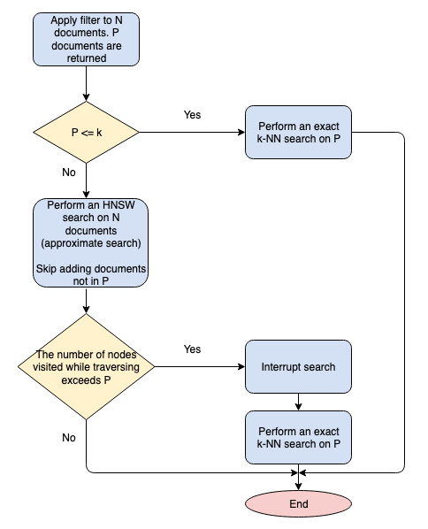
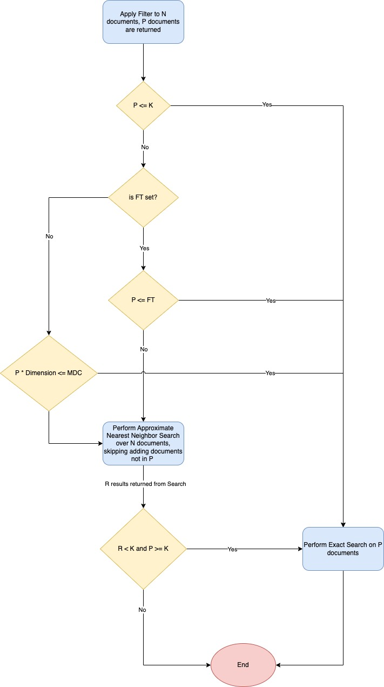

# k-NN search with filters
- Efficient k-NN filtering: This approach applies filtering during the k-NN search, as opposed to before or after the k-NN search, which ensures that k results are returned
- Post-filtering
- Scoring script filter (Pre-filtering)

Depending on engine (luence or faiss), the efficient algorithm follows a decision graph:

## Lucene efficient k-NN filter implementation

- N: The number of documents in the index.
- P: The number of documents in the document subset after the filter is applied (P <= N).
- k: The maximum number of vectors to return in the response.

## faiss efficient k-NN filter implementation
- **N**: The number of documents in the index.
- **P**: The number of documents in the document subset after the filter is applied (P <= N).
- **k**: The maximum number of vectors to return in the response.
- **R**: The number of results returned after performing the filtered approximate nearest neighbor search.
- **FT (filtered threshold)**: An index-level threshold defined in the `knn.advanced.filtered_exact_search_threshold` setting that specifies to switch to exact search.
- **MDC (max distance computations)**: The maximum number of distance computations allowed in exact search if FT (filtered threshold) is not set. This value cannot be changed.

[Examples](https://opensearch.org/docs/latest/search-plugins/knn/filter-search-knn/)
